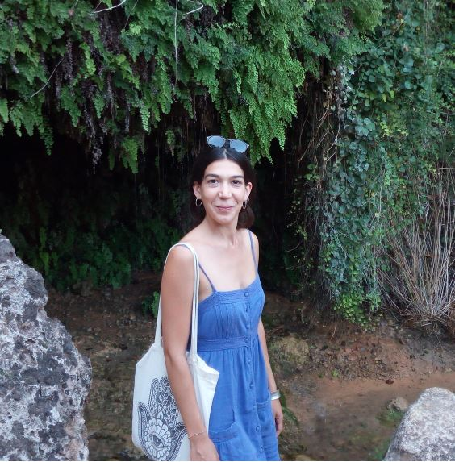

{width=30%}

#### `r emoji::emoji("bulb")` Research interest

My primary interest is in applied statistics, particularly in bridging statistics with various fields such as social sciences, health sciences, psychology, neuroscience, and medicine, to advance both domains. My challenge is to analyze data and related problems using appropriate and innovative statistical approaches. For that, I am a member of the [Psicostat](http://ip146179.psy.unipd.it/psicostat/web/) group at the University of Padova, [LoLa](https://lola.projects.unibz.it/?page_id=367&lang=it) group, and a [GBD (Italian division)](https://www.italian-gbd-initiative.it/) collaborator. I am a Research Fellow within the [Age-it](https://ageit.eu/wp/) and [Planet4Health](https://planet4health.eu/) projects.

My research interests lie in statistical methods for understanding and managing high-dimensional data, including dimension reduction techniques, statistical shape analysis, permutation tests, multiple testing, and selective inference.

#### `r emoji::emoji("bird")` Something about me

I am an Assistant Professor (RTT) in Statistics (SSD: STAT-01/A) at the Department of Economics and Management, University of Trento.

Previously, I was an Assistant Professor (RTD-A) in Social Statistics (SSD: SECS-S/05) at the Department of Economics, Ca’ Foscari University of Venice, where I worked—and continue to work—on various projects related to the analysis of Italian social welfare and health data.

Before that, I completed a postdoctoral fellowship at the Department of Statistical Sciences, University of Padova, under the supervision of Professors Bruno Scarpa and Livio Finos. Our work focused on sample size estimation for Partial Least Squares (PLS) classification in the context of power analysis.

I also held a postdoctoral position at the Department of Science and Technology, University of Insubria, under the supervision of Professor Antonietta Mira. This project involved modeling data from emergency call centers across the Lombardy region, Italy.

I earned my Ph.D. in Statistical Sciences at the University of Padova under the supervision of Professor Livio Finos, where I focused on statistical methods for analyzing neuroscience data, particularly functional MRI (fMRI) data.

My cv is downloadable [here](cv_eng.pdf).

