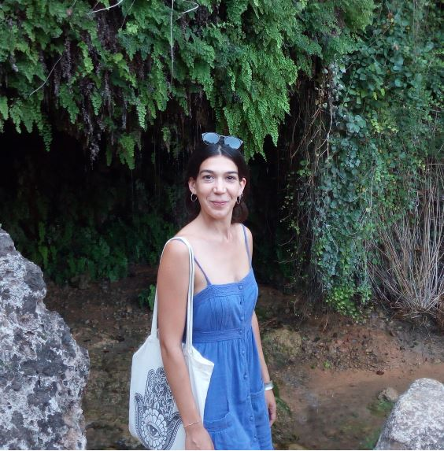

{width=30%}

#### `r emoji::emoji("bulb")` Research interest

My research focuses on statistical methods for understanding and managing high-dimensional data. I work with dimension reduction techniques, statistical shape analysis, permutation tests, multiple testing, and selective inference.

I enjoy analyzing data and tackling related challenges using innovative and appropriate statistical methods. I’m part of the [Psicostat](http://ip146179.psy.unipd.it/psicostat/web/) group at the University of Padova, the Italian division of the Global Burden of Disease ([Italian division](https://www.italian-gbd-initiative.it/)) study, and I’m a research fellow in the [Age-it](https://ageit.eu/wp/) and [Planet4Health](https://planet4health.eu/) projects.

#### `r emoji::emoji("bird")` Something about me

I am an Assistant Professor (RTT) in Statistics (SSD: STAT-01/A) at the Department of Economics and Management, University of Trento.

Previously, I was an Assistant Professor (RTD-A) in Social Statistics (SSD: SECS-S/05) at the Department of Economics, Ca’ Foscari University of Venice, where I worked—and continue to work—on various projects analyzing Italian social welfare and health data.

Before that, I completed a postdoctoral fellowship at the Department of Statistical Sciences, University of Padova, under the supervision of Professors Bruno Scarpa and Livio Finos, focusing on sample size estimation for Partial Least Squares (PLS) classification in the context of power analysis.

I also held a postdoctoral position at the Department of Science and Technology, University of Insubria, working with Professor Antonietta Mira on modeling data from emergency call centers across the Lombardy region, Italy.

I earned my Ph.D. in Statistical Sciences at the University of Padova under the supervision of Professor Livio Finos, where I focused on statistical methods for analyzing neuroscience data, particularly functional MRI (fMRI) data.

You can download my CV [here](cv_eng.pdf).

